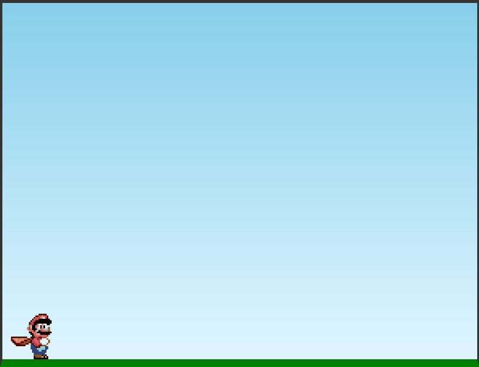

# The Mario Game

## :camera: Demo

<h1 align="center">
    
</h1>

## :rocket: Tecnologias

Esse projeto foi desenvolvido com as seguintes tecnologias:

✔️HTML

✔️CSS

✔️JavaScript

## 💻 Projeto

GoFinances uma aplicação financeira consumindo a API do back-end, gerenciando transações.

## ⚙ Configuração

1- Para iniciar o jogo:

https://the-mario-game.vercel.app